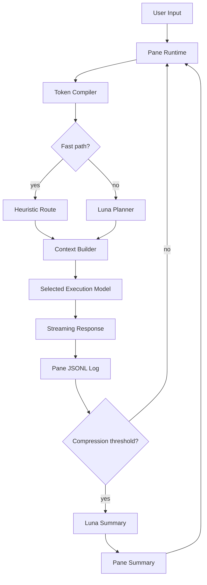

# Architecture

## Runtime layers

### Launcher

`chatgpt run start` owns Room discovery/creation and opens the selected Room in a separate Terminal tab.

### Room runtime

A Room maps to one tmux session when tmux is available. The session is the terminal representation of the problem being worked on.

### Pane runtime

Each Pane is a separate `chatgpt pane run` process. This deliberately avoids shared in-memory conversation state and makes parallel tasks isolated and cheap to reason about.

### Token Compiler

The compiler is a pre-execution control layer. It minimizes expensive-model work by deciding:

- whether a planner call is worth its own cost
- which model should execute
- how much reasoning is appropriate
- how much recent context should be included
- whether the task appears parallelizable

### Context Builder

The context builder never sends the entire Pane log by default. It combines the Room goal, the durable compressed summary, a bounded recent-message window and the current request.

### Storage

The filesystem is the source of truth. Append-only JSONL allows simple inspection, backup, grep/jq processing and future migrations without introducing a database.

## Token optimization principles

1. **Avoid optimization overhead on trivial prompts.** A planner that costs more than the answer is a failed optimizer.
2. **Escalate progressively.** Use stronger reasoning only when task complexity justifies it.
3. **Reduce context before increasing intelligence.** Clean context often provides more value than simply increasing reasoning effort.
4. **Summarize durable state, not every turn.** Compression runs only after history thresholds.
5. **Keep Pane contexts independent.** One side task should not automatically inflate every other Pane's prompt.
6. **Measure first, automate later.** Usage is persisted so routing thresholds can later be calibrated from real runs.

## Future architecture

The next runtime layer should add a Judge after the first execution. It can cheaply decide `DONE`, `ESCALATE`, or `DECOMPOSE`, enabling selective subagent spawning without paying for multi-agent execution by default.
